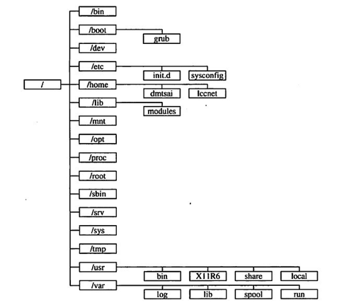
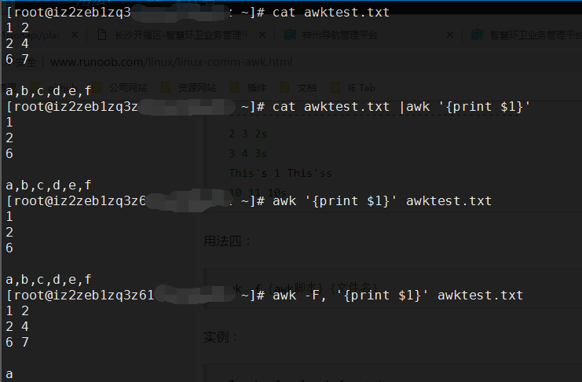
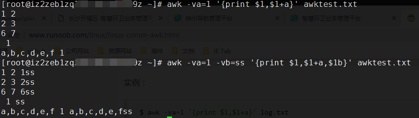
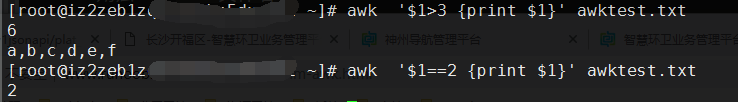

_一天一个小命令_

## 分区操作

### Linux目录说明

`/` 根目录

`/bin` 系统启动时需要的执行文件（二进制）,/boot/vmlinuz为linux的内核文件，以及/boot/gurb

`/dev` 存放linux系统下的设备文件，访问该目录下某个文件，相当于访问某个设备，常用的是挂载光驱   mount /dev/cdrom /mnt

`/etc`：系统配置文件存放的目录

`/lib`:/usr/lib:/usr/local/lib：系统使用的函数库的目录，程序在执行过程中，需要调用一些额外的参数时需要函数库的协助，比较重要的目录为/lib/modules

`/mnt` --- 临时用于挂载文件系统的地方。一般情况下这个目录是空的

`/opt`：给主机额外安装软件所摆放的目录

`/proc`：此目录的数据都在内存中，如系统核心，外部设备，网络状态，由于数据都存放于内存中，所以不占用磁盘空间，比较重要的目录有/proc/cpuinfo、/proc/interrupts、/proc/dma、/proc/ioports、/proc/net/

`/root` 启动Linux使用的核心文件,如操作系统内核,引导程序等 

`sbin` --- 系统管理员命令，与用户相关

`/srv`：服务启动之后需要访问的数据目录

`/usr`：应用程序存放目录，/usr/bin存放应用程序，/usr/share存放共享数据，/usr/lib存放不能直接运行的，却是许多程序运行所必需的一些函数库文件。/usr/local:存放软件升级包。/usr/share/doc:系统说明文件存放目录。/usr/share/man: 程序说明文件存放目录

`/var`：放置系统执行过程中经常变化的文件，如随时更改的日志文件/var/log，/var/log/message：所有的登录文件存放目录，/var/spool/mail：邮件存放的目录，/var/run:程序或服务启动后，其PID存放在该目录下。

`/tmp`：一般用户或正在执行的程序临时存放文件的目录,任何人都可以访问,重要数据不可放置在此目录下

### 系统分区

**主分区**：*也叫引导分区，最多可能创建4个，当创建四个主分区时候，就无法再创建扩展分区了，当然也就没有逻辑分区了。主分区是独立的，对应磁盘上的第一个分区，“一般”就是C盘。在Windows系统把所有的主分区和逻辑分区都叫做“盘”或者“驱动器”，并且把所有的可存储介质都显示为操作系统的“盘”。因此，从“盘”的概念上无法区分主分区和逻辑分区。并且盘符可以在操作系统中修改，这就是要加上“一般”二字的原因。*

**扩展分区**：*除了主分区外，剩余的磁盘空间就是扩展分区了，扩展分区是一个概念，实际上是看不到的。当整个硬盘分为一个主分区的时候，就没有了扩展分区。*

**逻辑分区**：*在扩展分区上面，可以创建多个逻辑分区。逻辑分区相当于一块存储截止，和操作系统还有别的逻辑分区、主分区没有什么关系，是“独立的”。*

**活动分区**：*就是当前活动的、操作系统可以启动的分区。*

### 创建分区

`fdisk -l` 查看分区信息

[具体创建过程](https://www.aliyun.com/jiaocheng/160393.html)

*Linux 命令大全 [参考文档](http://man.linuxde.net/)*

## 文件操作

### help/man  帮助命令
  
    ls --hlep  查看ls命令帮助
    man ls   查看ls详细说明

###  ls 查看文件夹下的内容

*用法:* `ls <option> <fileName|path>`

*参数:*   
  
    -a 查看当前目录下所有文件,包括隐藏文件
    -l 显示文件详细信息,等同于 ll
    -m 以逗号分隔的方式显示文件
    -h 以人类可读方式显示文件信息 e.g. 1K 234M 2G

*示例:*
    
    ls -l

  

###  jar 对jar/war文件进行操作

*用法:* `jar {ctxui}[vfmn0PMe] [jar-file] [manifest-file] [entry-point] [-C dir] files ...`

*选项：*  

       -c 创建新文档
       -t  列出档案目录
       -x  从档案中提取指定的 (或所有) 文件
       -u  更新现有档案
       -v  在标准输出中生成详细输出
       -f  指定档案文件名
       -e  为捆绑到可执行 jar 文件的独立应用程序指定应用程序入口点
       -C  更改为指定的目录并包含以下文件`

*示例 1:*  将两个类文件归档到一个名为 classes.jar 的档案中:

       jar cvf classes.jar Foo.class Bar.class

*示例 2:*  使用现有的清单文件 'mymanifest' 并将 foo/ 目录中的所有文件归档到 'classes.jar' 中: 

       jar cvfm classes.jar mymanifest -C foo/ .

*示例 3:*  替换jar/war包内容

    jar tvf vedio.war | grep MediaController  查找文件所在目录
    jar xvf vedio.war /WEB-INF/classes/com/cygps/controller/MediaController 解压指定文件
    cp MediaController.class WEB-INF/classes/com/ivmscy/controller/  复制文件到解压后的目录
    jar uvf vedio.war WEB-INF/classes/com/ivmscy/controller/  添加文件到war包

### grep 文本搜索

*用法:* `grep [-acinv] [--color=auto] '搜寻字符串' filename`

*参数:*

    -a ：将 binary 文件以 text 文件的方式搜寻数据
    -c ：计算找到 '搜寻字符串' 的次数
    -i ：忽略大小写的不同，所以大小写视为相同
    -n ：顺便输出行号
    -r ：遍历文件夹
    -v ：反向选择，亦即显示出没有 '搜寻字符串' 内容的那一行！

*示例 1:*  查找/etc/passwd 下包含 root 字符串的文件

    grep -rn 'root' /etc/

*示例2:*  递归查找文件

    grep 'energywise' *           
    在当前目录搜索带'energywise'行的文件

    grep -r 'energywise'  *      
    在当前目录及其子目录下搜索'energywise'行的文件

    grep -l -r 'energywise' *     
    在当前目录及其子目录下搜索'energywise'行的文件，但是不显示匹配的行，只显示匹配的文件

*示例3:* 正则查找字符串
  
    查找 test 或 tast
    [root@www ~]# grep -n 't[ae]st' regular_express.txt
    8:I can't finish the test.
    9:Oh! The soup taste good.

    字符类的反向选择 [^] ：如果想要搜索到有 oo 的行，但不想要 oo 前面有 g
    [root@www ~]# grep -n '[^g]oo' regular_express.txt
    2:apple is my favorite food.
    3:Football game is not use feet only.
    18:google is the best tools for search keyword.

    不以小写字母开头
    [root@www ~]# grep -n '[^a-z]oo' regular_express.txt
    3:Football game is not use feet only.

    [0-9]   匹配数字
    ^the    匹配行首
    [a-zA-Z]  字母
    g..d    开头为 g,结尾为 d的字符串

###  ps 用于显示当前进程 (process) 的状态。

*用法:* `ps [option]`

*参数:*
  
    -A 列出所有的进程
    -aux 显示所有包含其他使用者的进程
        输出参数说明:
        USER: 行程拥有者
        PID: pid
        %CPU: 占用的 CPU 使用率
        %MEM: 占用的记忆体使用率
        VSZ: 占用的虚拟记忆体大小
        RSS: 占用的记忆体大小
        TTY: 终端的次要装置号码 (minor device number of tty)
        STAT: 该行程的状态:
        D: 不可中断的静止 (通悸□□缜b进行 I/O 动作)
        R: 正在执行中
        S: 静止状态
        T: 暂停执行
        Z: 不存在但暂时无法消除
        W: 没有足够的记忆体分页可分配
        <: 高优先序的行程
        N: 低优先序的行程
        L: 有记忆体分页分配并锁在记忆体内 (实时系统或捱A I/O)
        START: 行程开始时间
        TIME: 执行的时间
        COMMAND:所执行的指令

*示例1:*
    
    ps -u root //显示root进程用户信息

*示例2:*

    ps -ef //显示所有命令，连带命令行
    ps -ef|grep tomcat 显示tomcat进程信息

### tail 显示文档最后几行，如果有更新，自动显示

*用法：* `tail [ -f ] [ -c Number | -n Number | -m Number | -b Number | -k Number ] [ File ]`

*参数：*

    -f 该参数用于监视File文件增长。
    -c Number 从 Number 字节位置读取指定文件
    -n Number 从 Number 行位置读取指定文件。
    -m Number 从 Number 多字节字符位置读取指定文件，比方你的文件假设包括中文字，假设指定-c参数，
              可能导致截断，但使用-m则会避免该问题。
    -b Number 从 Number 表示的512字节块位置读取指定文件。
    -k Number 从 Number 表示的1KB块位置读取指定文件。

    不指定Number，默认显示10行

*示例：*
    
    tail -f fileName  监视filename文件的尾部内容（默认10行，相当于增加参数 -n 10），
                      刷新显示在屏幕上。退出，按下CTRL+C
    tail -n 20 filename  显示filename最后20行。
    tail -r -n 10 fileName  逆序显示filename最后10行

### locate 查找文件或目录

*简介:*
    
    locate命令要比find -name快得多，原因在于它不搜索具体目录，而是搜索一个数据库/var/lib/mlocate/mlocate.db 。这个数据库中含有本地所有文件信息。Linux系统自动创建这个数据库，并且每天自动更新一次，因此，我们在用whereis和locate 查找文件时，有时会找到已经被删除的数据，或者刚刚建立文件，却无法查找到，原因就是因为数据库文件没有被更新。为了避免这种情况，可以在使用locate之前，先使用updatedb命令，手动更新数据库。整个locate工作其实是由四部分组成的:

    /usr/bin/updatedb   主要用来更新数据库，通过crontab自动完成的

    /usr/bin/locate         查询文件位置

    /etc/updatedb.conf   updatedb的配置文件

    /var/lib/mlocate/mlocate.db  存放文件信息的文件

*用法:*

    locate [OPTION]... [PATTERN]...

*参数:*

    -b, --basename         match only the base name of path names
    -c, --count            只输出找到的数量
    -d, --database DBPATH  使用DBPATH指定的数据库，而不是默认数据库 
                           +/var/lib/mlocate/mlocate.db
    -i, --ignore-case      忽略大小写
    -q, --quiet            安静模式，不会显示任何错误讯息
    -r, --regexp REGEXP    使用基本正则表达式
    --regex            使用扩展正则表达式

*示例:*

    搜索etc目录下所有以my开头的文件
    
        locate /etc/my

### chmod 更改文件权限

*用法：* `chmod [-cfvR] [--help] [--version] [mode] [file]`

*参数：*

    mode参数 : 权限设定字串，格式如下 :
    [ugoa][[+-=][rwxX]
    u 表示该文件的拥有者，g 表示与该文件的拥有者属于同一个群体(group)者，o 表示其他以外的人，a 表示这三者皆是。
    + 表示增加权限、- 表示取消权限、= 表示唯一设定权限。
    r 表示可读取，w 表示可写入，x 表示可执行，X 表示只有当该文件是个子目录或者该文件已经被设定过为可执行

    其他参数：
    -c : 若该文件权限确实已经更改，才显示其更改动作
    -f : 若该文件权限无法被更改也不要显示错误讯息
    -v : 显示权限变更的详细资料
    -R : 对目前目录下的所有文件与子目录进行相同的权限变更(即以递回的方式逐个变更)

*示例：*

    1.chmod a-rwx 1.zip 取消1.zip的所有权限

    2.此外chmod也可以用数字来表示权限如 :
        chmod 777 file   语法为： chmod abc file
        其中a,b,c各为一个数字，分别表示User、Group、及Other的权限。

        r=4，w=2，x=1
        若要rwx属性则4+2+1=7；
        若要rw-属性则4+2=6；
        若要r-x属性则4+1=5。

        chmod a=rwx file 和 chmod 777 file 一个效果

### cat 查看文件内容

*用法：* `cat [-AbeEnstTuv] [--help] [--version] fileName`

*参数：*

    -n 或 --number：由 1 开始对所有输出的行数编号。
    -b 或 --number-nonblank：和 -n 相似，只不过对于空白行不编号。
    -s 或 --squeeze-blank：当遇到有连续两行以上的空白行，就代换为一行的空白行。
    -v 或 --show-nonprinting：使用 ^ 和 M- 符号，除了 LFD 和 TAB 之外。
    -E 或 --show-ends : 在每行结束处显示 $。
    -T 或 --show-tabs: 将 TAB 字符显示为 ^I。
    -A, --show-all：等价于 -vET。
    -e：等价于"-vE"选项；
    -t：等价于"-vT"选项；

### unzip 解压文件

*用法：* `unzip [-cflptuvz][-agCjLMnoqsVX][-P <密码>][.zip文件][文件][-d <目录>][-x <文件>] 或 unzip [-Z]`

*参数：*

    -c 将解压缩的结果显示到屏幕上，并对字符做适当的转换。
    -f 更新现有的文件。
    -l 显示压缩文件内所包含的文件。
    -p 与-c参数类似，会将解压缩的结果显示到屏幕上，但不会执行任何的转换。
    -t 检查压缩文件是否正确。
    -u 与-f参数类似，但是除了更新现有的文件外，也会将压缩文件中的其他文件解压缩到目录中。
    -v 执行是时显示详细的信息。
    -z 仅显示压缩文件的备注文字。
    -a 对文本文件进行必要的字符转换。
    -b 不要对文本文件进行字符转换。
    -C 压缩文件中的文件名称区分大小写。
    -j 不处理压缩文件中原有的目录路径。
    -L 将压缩文件中的全部文件名改为小写。
    -M 将输出结果送到more程序处理。
    -n 解压缩时不要覆盖原有的文件。
    -o 不必先询问用户，unzip执行后覆盖原有文件。
    -P<密码> 使用zip的密码选项。
    -q 执行时不显示任何信息。
    -s 将文件名中的空白字符转换为底线字符。
    -V 保留VMS的文件版本信息。
    -X 解压缩时同时回存文件原来的UID/GID。
    [.zip文件] 指定.zip压缩文件。
    [文件] 指定要处理.zip压缩文件中的哪些文件。
    -d<目录> 指定文件解压缩后所要存储的目录。
    -x<文件> 指定不要处理.zip压缩文件中的哪些文件。
    -Z unzip -Z等于执行zipinfo指令。

*示例：*

    unzip -o 1.zip -d demo/ 将1.zip解压到demo里面

### zip压缩文件

*用法：* `zip [ 参数 ] [ 打包后的文件名 ] [ 打包的目录路径 ]`

*参数：*

    -a 将文件转成ASCII模式
    -F 尝试修复损坏的压缩文件
    -m 将文件压缩之后，删除源文件
    -n 特定字符串 不压缩具有特定字尾字符串的文件
    -o 将压缩文件内的所有文件的最新变动时间设为压缩时候的时间
    -q 安静模式，在压缩的时候不显示指令的执行过程
    -r 将指定的目录下的所有子目录以及文件一起处理
    -S 包含系统文件和隐含文件（S是大写）
    -t 日期 把压缩文件的最后修改日期设为指定的日期，日期格式为mmddyyyy

*示例：*

    zip -r ./demo-zip.zip ./demo-zip

   

###  rz 文件上传

*示例:*

   

###  sz 文件下载

*用法:*  `sz 文件名`

*示例:*

   

### awk 对文本和数据进行格式处理

*用法：* `awk [options] 'pattern{action}' file`

*参数：*
    
    -F fs or --field-separator fs
        指定输入文件折分隔符，fs是一个字符串或者是一个正则表达式，如-F:。
    -v var=value or --asign var=value
        赋值一个用户定义变量。
    -f scripfile or --file scriptfile
        从脚本文件中读取awk命令。

*内建变量：*

| 变量 | 描述 | 
| ------ | ------ | 
| FS  |  字段分隔符(默认是任何空格)|
| $n  |  当前记录的第n个字段，字段间由FS分隔|
| $0  |  完整的输入记录|
| ARGC | 命令行参数的数目|
| ARGIND |命令行中当前文件的位置(从0开始算)||
| FILENAME | 当前文件名|
| OFMT  |数字的输出格式(默认值是%.6g)|

*示例 1：*

*示例 2：*

*示例 3：*

*示例 4(正则查询)：*

`awk '$1 ~ /2/ {print $0}' awktest.txt`  查找第一列为2的行,  `$1`:第一列 `~:`正则开始 `//`:模式

`awk '/2/ {print $0}' awktest.txt`     查找包含2的行

`awk '$1 !~ /2/ {print $0}' awktest.txt`       取反

*其他：*

`ls -l *.txt | awk '{sum+=$6} END {print sum}'`  计算文件大小

`awk 'length>3' awktest.txt`     从文件中找出长度大于3的行

`seq 9 | sed 'H;g' | awk -v RS='' '{for(i=1;i<=NF;i++)printf("%dx%d=%d%s", i, NR, i*NR, i==NR?"\n":"\t")}'`       打印九九乘法表

## 系统

### lsof 列出当前系统打开的文件

*用法：* ` lsof ［options］ file`

*常用示例：*

`lsof ./chat-example/`  查看谁正在使用这个文件

`lsof -i :3306`     查看哪个程序正在使用端口

`lsof -i udp:55`    列出谁在使用某个特定的udp端口

`lsof +D /root/software/` 递归查看某个目录的文件信息

`lsof -N`   列出所有网络文件系统

### du/df 查询文件大小

*用法：* ` df/du ［options］ [file]`

*区别 :*
    
df记录的是通过文件系统获取到的文件的大小,包括`已删除文件`(当我们删除一个文件的时候，这个文件不 
是马上就在文件系统当中消失了，而是暂时消失了，当所有程序都不用时，才会根据OS的规则释放掉已 
经删除的文件)

*常用示例：*

_示例1_
    
    df -h

    文件系统        容量  已用  可用 已用% 挂载点
    /dev/sda3       534G  288G  219G   57% /
    devtmpfs        3.9G     0  3.9G    0% /dev
    tmpfs           3.9G     0  3.9G    0% /dev/shm
    tmpfs           3.9G   66M  3.8G    2% /run
    tmpfs           3.9G     0  3.9G    0% /sys/fs/cgroup
    /dev/sda1       120M   99M   13M   89% /boot
    tmpfs           782M     0  782M    0% /run/user/0
  
_示例2_

    du -h --max-depth=2 .  输出当前目录下各个子目录所使用的空间

### ifconfig 配置和显示Linux内核中网络接口的网络参数

*用法：* ` ifconfig ［options]`

*options：*

    add<地址>：设置网络设备IPv6的ip地址；
    del<地址>：删除网络设备IPv6的IP地址；
    down：关闭指定的网络设备；
    io_addr<I/O地址>：设置网络设备的I/O地址；
    irq<IRQ地址>：设置网络设备的IRQ；
    media<网络媒介类型>：设置网络设备的媒介类型；
    mem_start<内存地址>：设置网络设备在主内存所占用的起始地址；
    metric<数目>：指定在计算数据包的转送次数时，所要加上的数目；
    mtu<字节>：设置网络设备的MTU；
    netmask<子网掩码>：设置网络设备的子网掩码；
    tunnel<地址>：建立IPv4与IPv6之间的隧道通信地址；
    up：启动指定的网络设备；
    -broadcast<地址>：将要送往指定地址的数据包当成广播数据包来处理；
    -pointopoint<地址>：与指定地址的网络设备建立直接连线，此模式具有保密功能；
    -promisc：关闭或启动指定网络设备的promiscuous模式；

*示例：*

    [root@iz2zeb1zq3z ~]# ifconfig
    eth0  Link encap:Ethernet  HWaddr 00:16:3E:00:1E:51  
          inet addr:10.160.7.81  Bcast:10.160.15.255  Mask:255.255.240.0
          UP BROADCAST RUNNING MULTICAST  MTU:1500  Metric:1
          RX packets:61430830 errors:0 dropped:0 overruns:0 frame:0
          TX packets:88534 errors:0 dropped:0 overruns:0 carrier:0
          collisions:0 txqueuelen:1000
          RX bytes:3607197869 (3.3 GiB)  TX bytes:6115042 (5.8 MiB)

    lo    Link encap:Local Loopback  
          inet addr:127.0.0.1  Mask:255.0.0.0
          UP LOOPBACK RUNNING  MTU:16436  Metric:1
          RX packets:56103 errors:0 dropped:0 overruns:0 frame:0
          TX packets:56103 errors:0 dropped:0 overruns:0 carrier:0
          collisions:0 txqueuelen:0
          RX bytes:5079451 (4.8 MiB)  TX bytes:5079451 (4.8 MiB)

`eth0`表示第一块网卡，其中HWaddr表示网卡的物理地址，可以看到目前这个网卡的物理地址 (MAC地址) 是`00:16:3E:00:1E:51`。

`inet addr`用来表示网卡的IP地址，此网卡的IP地址是`10.160.7.81`，广播地址Bcast:`10.160.15.255`，掩码地址Mask:`255.255.240.0`

`lo`是表示主机的回环地址，这个一般是用来测试一个网络程序，但又不想让局域网或外网的用户能够查看，只能在此台主机上运行和查看所用的网络接口。比如把 httpd服务器的指定到回环地址，在浏览器输入127.0.0.1就能看到你所架WEB网站了。但只是您能看得到，局域网的其它主机或用户无从知道。

    第一行：连接类型：Ethernet（以太网）HWaddr（硬件mac地址）。
    第二行：网卡的IP地址、子网、掩码。
    第三行：UP（代表网卡开启状态）RUNNING（代表网卡的网线被接上）MULTICAST（支持组播）MTU:1500（最大传输单元）：1500字节。
    第四、五行：接收、发送数据包情况统计。
    第七行：接收、发送数据字节数统计信息。

*启动关闭指定网卡：*

    ifconfig eth0 up
    ifconfig eth0 down
    ifconfig eth0 up为启动网卡eth0，ifconfig eth0 down为关闭网卡eth0。ssh登陆linux服务器操作要小心，关闭了就不能开启了，除非你有多网卡。

*为网卡配置和删除IPv6地址：*

    ifconfig eth0 add 33ffe:3240:800:1005::2/64    #为网卡eth0配置IPv6地址
    ifconfig eth0 del 33ffe:3240:800:1005::2/64    #为网卡eth0删除IPv6地址

*用ifconfig修改MAC地址：*

    ifconfig eth0 hw ether 00:AA:BB:CC:dd:EE

*配置IP地址：*

    [root@localhost ~]# ifconfig eth0 192.168.2.10
    [root@localhost ~]# ifconfig eth0 192.168.2.10 netmask 255.255.255.0
    [root@localhost ~]# ifconfig eth0 192.168.2.10 netmask 255.255.255.0 broadcast 192.168.2.255

*启用和关闭arp协议：*

    ifconfig eth0 arp   #开启网卡eth0 的arp协议
    ifconfig eth0 -arp   #关闭网卡eth0 的arp协议

*设置最大传输单元：*

    ifconfig eth0 mtu 1500    #设置能通过的最大数据包大小为 1500 bytes

### free 显示内存状态
*用法：* ` free [-bkmotV][-s <间隔秒数>]`

*options：*

    -b 　以Byte为单位显示内存使用情况。
    -k 　以KB为单位显示内存使用情况。
    -m 　以MB为单位显示内存使用情况
    -s<间隔秒数> 　持续观察内存使用状况。
    -t 　显示内存总和列。

*示例 :*

    [root@iZ2ze1bs0o0pc ~]# free -m
                 total       used       free     shared    buffers     cached

    Mem:         32168      30119       2048          0       4438      11097

    -/+ buffers/cache:      14583      17584

    Swap:        31996       1899      30097

*返回参数说明*

+ 第二行 Mem

`total`:总计物理内存的大小。

`used`:已使用多大。

`free`:可用有多少。

`Shared`:多个进程共享的内存总额。

`Buffers/cached`:磁盘缓存的大小。

+ 第三行(-/+ buffers/cached):

`used`:已使用多大。

`free`:可用有多少。

+ 第四行

是交换分区SWAP的，也就是我们通常所说的虚拟内存。

**区别**：第二行(mem)的used/free与第三行(-/+ buffers/cache) used/free的区别。 这两个的区别在于使用的角度来看，第一行是从`OS的角度来看`，因为对于OS，buffers/cached 都是属于被使用，其中包括，内核（OS）使用+Application(X, oracle,etc)使用的+buffers+cached.

第三行所指的是`从应用程序角度来看`，对于应用程序来说，buffers/cached 是等于可用的，因为buffer/cached是为了提高文件读取的性能，当应用程序需在用到内存的时候，buffer/cached会很快地被回收。

所以从应用程序的角度来说，可用内存=系统free memory+buffers+cached。

## 网络操作

### wget 从指定地址下载文件

*用法：* ` wget [options] 参数`

*options：*

    -b：进行后台的方式运行wget；
    -nc：文件存在时，下载文件不覆盖原有文件；
    -i<文件>：从指定文件获取要下载的URL地址；

*示例 :*
    
    下载单个文件
    wget http://www.linuxde.net/testfile.zip

    下载并以不同的文件名保存
    wget -O wordpress.zip http://www.linuxde.net/download.aspx?id=1080

    使用wget断点续传
    wget -c http://www.linuxde.net/testfile.zip

### scp 远程文件拷贝

*用法：* `scp [可选参数] file_source file_target `

*options：*

    -r： 递归复制整个目录
    -P port：注意是大写的P, port是指定数据传输用到的端口号
    -v：详细方式显示输出
    -4： 强制scp命令只使用IPv4寻址

*示例：*

1. 从本地复制到远程
    scp -r local_folder remote_username@remote_ip:remote_folder 
    或者 
    scp -r local_folder remote_ip:remote_folder 

2. 从远程复制到本地

    scp remote_username@remote_ip:/home/root/others/music /home/space/music/1.mp3 
    scp -r remote_ip:/home/root/others/ /home/space/music/

### wall 向所有终端发送信息

*用法：*

    [root@localhost ~]# wall this is a test line

    Broadcast message from root (pts/1) (Fri Dec 20 11:36:51 2013):

    this is a test line
    

## 任务管理

### jobs 显示任务列表及任务状态

> 以后台方式运行命令
    
    &
    ctrl + b

> 查看所有任务

    jobs

> 把后台任务放在前台执行

    fg %ID