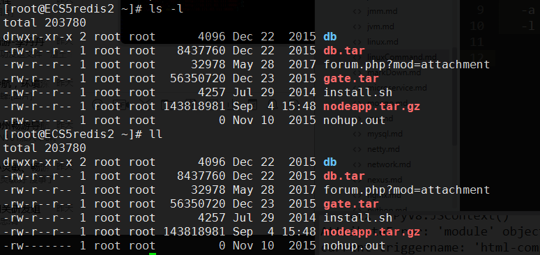
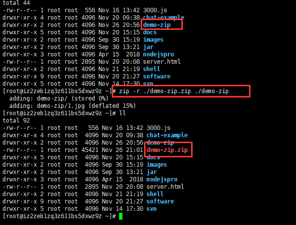
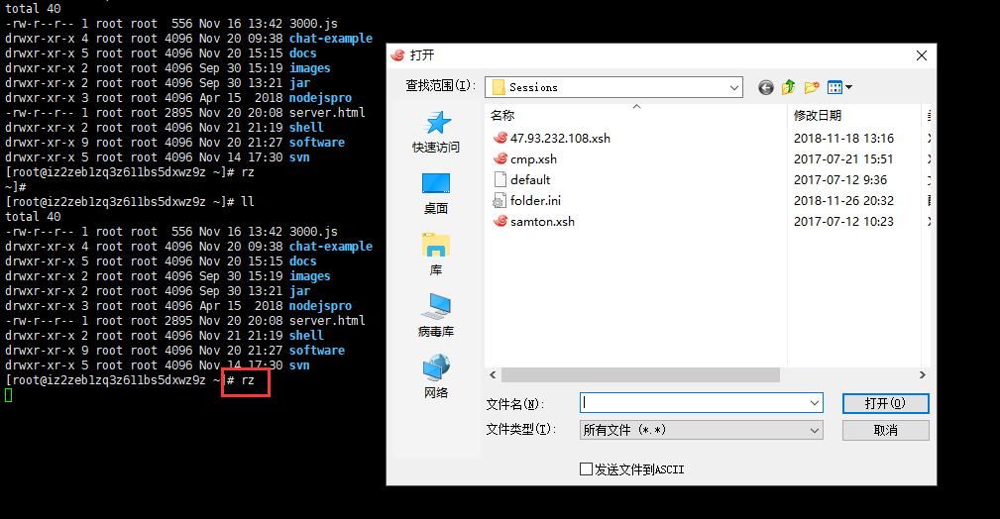
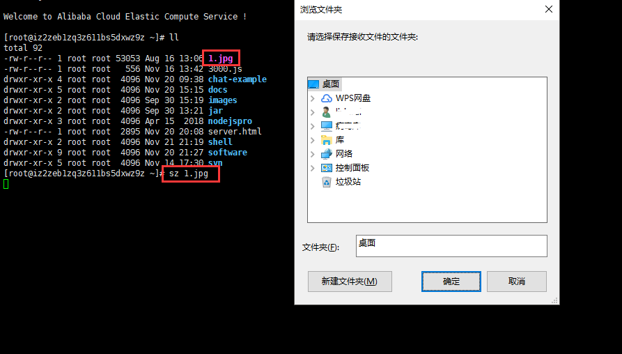

_一天一个小命令_

*Linux 命令大全 [参考文档](http://man.linuxde.net/)*

## 文件操作

### help/man  帮助命令
  
    ls --hlep  查看ls命令帮助
    man ls   查看ls详细说明

###  ls 查看文件夹下的内容

*用法:* `ls <option> <fileName|path>`

*参数:*   
  
    -a 查看当前目录下所有文件,包括隐藏文件
    -l 显示文件详细信息,等同于 ll
    -m 以逗号分隔的方式显示文件
    -h 以人类可读方式显示文件信息 e.g. 1K 234M 2G

*示例:*
    
    ls -l

  

###  jar 对jar/war文件进行操作

*用法:* `jar {ctxui}[vfmn0PMe] [jar-file] [manifest-file] [entry-point] [-C dir] files ...`

*选项：*  

       -c 创建新文档
       -t  列出档案目录
       -x  从档案中提取指定的 (或所有) 文件
       -u  更新现有档案
       -v  在标准输出中生成详细输出
       -f  指定档案文件名
       -e  为捆绑到可执行 jar 文件的独立应用程序指定应用程序入口点
       -C  更改为指定的目录并包含以下文件`

*示例 1:*  将两个类文件归档到一个名为 classes.jar 的档案中:

       jar cvf classes.jar Foo.class Bar.class

*示例 2:*  使用现有的清单文件 'mymanifest' 并将 foo/ 目录中的所有文件归档到 'classes.jar' 中: 

       jar cvfm classes.jar mymanifest -C foo/ .

*示例 3:*  替换jar/war包内容

    jar tvf vedio.war | grep MediaController  查找文件所在目录
    jar xvf vedio.war /WEB-INF/classes/com/cygps/controller/MediaController 解压指定文件
    cp MediaController.class WEB-INF/classes/com/ivmscy/controller/  复制文件到解压后的目录
    jar uvf vedio.war WEB-INF/classes/com/ivmscy/controller/  添加文件到war包

### grep 文本搜索

*用法:* `grep [-acinv] [--color=auto] '搜寻字符串' filename`

*参数:*

    -a ：将 binary 文件以 text 文件的方式搜寻数据
    -c ：计算找到 '搜寻字符串' 的次数
    -i ：忽略大小写的不同，所以大小写视为相同
    -n ：顺便输出行号
    -r ：遍历文件夹
    -v ：反向选择，亦即显示出没有 '搜寻字符串' 内容的那一行！

*示例 1:*  查找/etc/passwd 下包含 root 字符串的文件

    grep -rn 'root' /etc/

*示例2:*  递归查找文件

    grep 'energywise' *           
    在当前目录搜索带'energywise'行的文件

    grep -r 'energywise'  *      
    在当前目录及其子目录下搜索'energywise'行的文件

    grep -l -r 'energywise' *     
    在当前目录及其子目录下搜索'energywise'行的文件，但是不显示匹配的行，只显示匹配的文件

*示例3:* 正则查找字符串
  
    查找 test 或 tast
    [root@www ~]# grep -n 't[ae]st' regular_express.txt
    8:I can't finish the test.
    9:Oh! The soup taste good.

    字符类的反向选择 [^] ：如果想要搜索到有 oo 的行，但不想要 oo 前面有 g
    [root@www ~]# grep -n '[^g]oo' regular_express.txt
    2:apple is my favorite food.
    3:Football game is not use feet only.
    18:google is the best tools for search keyword.

    不以小写字母开头
    [root@www ~]# grep -n '[^a-z]oo' regular_express.txt
    3:Football game is not use feet only.

    [0-9]   匹配数字
    ^the    匹配行首
    [a-zA-Z]  字母
    g..d    开头为 g,结尾为 d的字符串

###  ps 用于显示当前进程 (process) 的状态。

*用法:* `ps [option]`

*参数:*
  
    -A 列出所有的进程
    -aux 显示所有包含其他使用者的进程
        输出参数说明:
        USER: 行程拥有者
        PID: pid
        %CPU: 占用的 CPU 使用率
        %MEM: 占用的记忆体使用率
        VSZ: 占用的虚拟记忆体大小
        RSS: 占用的记忆体大小
        TTY: 终端的次要装置号码 (minor device number of tty)
        STAT: 该行程的状态:
        D: 不可中断的静止 (通悸□□缜b进行 I/O 动作)
        R: 正在执行中
        S: 静止状态
        T: 暂停执行
        Z: 不存在但暂时无法消除
        W: 没有足够的记忆体分页可分配
        <: 高优先序的行程
        N: 低优先序的行程
        L: 有记忆体分页分配并锁在记忆体内 (实时系统或捱A I/O)
        START: 行程开始时间
        TIME: 执行的时间
        COMMAND:所执行的指令

*示例1:*
    
    ps -u root //显示root进程用户信息

*示例2:*

    ps -ef //显示所有命令，连带命令行
    ps -ef|grep tomcat 显示tomcat进程信息

### tail 显示文档最后几行，如果有更新，自动显示

*用法：* `tail [ -f ] [ -c Number | -n Number | -m Number | -b Number | -k Number ] [ File ]`

*参数：*

    -f 该参数用于监视File文件增长。
    -c Number 从 Number 字节位置读取指定文件
    -n Number 从 Number 行位置读取指定文件。
    -m Number 从 Number 多字节字符位置读取指定文件，比方你的文件假设包括中文字，假设指定-c参数，
              可能导致截断，但使用-m则会避免该问题。
    -b Number 从 Number 表示的512字节块位置读取指定文件。
    -k Number 从 Number 表示的1KB块位置读取指定文件。

    不指定Number，默认显示10行

*示例：*
    
    tail -f fileName  监视filename文件的尾部内容（默认10行，相当于增加参数 -n 10），
                      刷新显示在屏幕上。退出，按下CTRL+C
    tail -n 20 filename  显示filename最后20行。
    tail -r -n 10 fileName  逆序显示filename最后10行

<<<<<<< HEAD
### locate 查找文件或目录

*简介:*
    
    locate命令要比find -name快得多，原因在于它不搜索具体目录，而是搜索一个数据库/var/lib/mlocate/mlocate.db 。这个数据库中含有本地所有文件信息。Linux系统自动创建这个数据库，并且每天自动更新一次，因此，我们在用whereis和locate 查找文件时，有时会找到已经被删除的数据，或者刚刚建立文件，却无法查找到，原因就是因为数据库文件没有被更新。为了避免这种情况，可以在使用locate之前，先使用updatedb命令，手动更新数据库。整个locate工作其实是由四部分组成的:

    /usr/bin/updatedb   主要用来更新数据库，通过crontab自动完成的

    /usr/bin/locate         查询文件位置

    /etc/updatedb.conf   updatedb的配置文件

    /var/lib/mlocate/mlocate.db  存放文件信息的文件

*用法:*

    locate [OPTION]... [PATTERN]...

*参数:*

    -b, --basename         match only the base name of path names
    -c, --count            只输出找到的数量
    -d, --database DBPATH  使用DBPATH指定的数据库，而不是默认数据库 
                           +/var/lib/mlocate/mlocate.db
    -i, --ignore-case      忽略大小写
    -q, --quiet            安静模式，不会显示任何错误讯息
    -r, --regexp REGEXP    使用基本正则表达式
    --regex            使用扩展正则表达式

*示例:*

    搜索etc目录下所有以my开头的文件
    
        locate /etc/my

### chmod 更改文件权限

*用法：* `chmod [-cfvR] [--help] [--version] [mode] [file]`

*参数：*

    mode参数 : 权限设定字串，格式如下 :
    [ugoa][[+-=][rwxX]
    u 表示该文件的拥有者，g 表示与该文件的拥有者属于同一个群体(group)者，o 表示其他以外的人，a 表示这三者皆是。
    + 表示增加权限、- 表示取消权限、= 表示唯一设定权限。
    r 表示可读取，w 表示可写入，x 表示可执行，X 表示只有当该文件是个子目录或者该文件已经被设定过为可执行

    其他参数：
    -c : 若该文件权限确实已经更改，才显示其更改动作
    -f : 若该文件权限无法被更改也不要显示错误讯息
    -v : 显示权限变更的详细资料
    -R : 对目前目录下的所有文件与子目录进行相同的权限变更(即以递回的方式逐个变更)
    --help : 显示辅助说明
    --version : 显示版本

*示例：*

    1.chmod a-rwx 1.zip 取消1.zip的所有权限

    2.此外chmod也可以用数字来表示权限如 :
        chmod 777 file   语法为： chmod abc file
        其中a,b,c各为一个数字，分别表示User、Group、及Other的权限。

        r=4，w=2，x=1
        若要rwx属性则4+2+1=7；
        若要rw-属性则4+2=6；
        若要r-x属性则4+1=5。

        chmod a=rwx file 和 chmod 777 file 一个效果

### cat 查看文件内容

*用法：* `cat [-AbeEnstTuv] [--help] [--version] fileName`

*参数：*

    -n 或 --number：由 1 开始对所有输出的行数编号。
    -b 或 --number-nonblank：和 -n 相似，只不过对于空白行不编号。
    -s 或 --squeeze-blank：当遇到有连续两行以上的空白行，就代换为一行的空白行。
    -v 或 --show-nonprinting：使用 ^ 和 M- 符号，除了 LFD 和 TAB 之外。
    -E 或 --show-ends : 在每行结束处显示 $。
    -T 或 --show-tabs: 将 TAB 字符显示为 ^I。
    -A, --show-all：等价于 -vET。
    -e：等价于"-vE"选项；
    -t：等价于"-vT"选项；

### unzip 解压文件

*用法：* `unzip [-cflptuvz][-agCjLMnoqsVX][-P <密码>][.zip文件][文件][-d <目录>][-x <文件>] 或 unzip [-Z]`

*参数：*

    -c 将解压缩的结果显示到屏幕上，并对字符做适当的转换。
    -f 更新现有的文件。
    -l 显示压缩文件内所包含的文件。
    -p 与-c参数类似，会将解压缩的结果显示到屏幕上，但不会执行任何的转换。
    -t 检查压缩文件是否正确。
    -u 与-f参数类似，但是除了更新现有的文件外，也会将压缩文件中的其他文件解压缩到目录中。
    -v 执行是时显示详细的信息。
    -z 仅显示压缩文件的备注文字。
    -a 对文本文件进行必要的字符转换。
    -b 不要对文本文件进行字符转换。
    -C 压缩文件中的文件名称区分大小写。
    -j 不处理压缩文件中原有的目录路径。
    -L 将压缩文件中的全部文件名改为小写。
    -M 将输出结果送到more程序处理。
    -n 解压缩时不要覆盖原有的文件。
    -o 不必先询问用户，unzip执行后覆盖原有文件。
    -P<密码> 使用zip的密码选项。
    -q 执行时不显示任何信息。
    -s 将文件名中的空白字符转换为底线字符。
    -V 保留VMS的文件版本信息。
    -X 解压缩时同时回存文件原来的UID/GID。
    [.zip文件] 指定.zip压缩文件。
    [文件] 指定要处理.zip压缩文件中的哪些文件。
    -d<目录> 指定文件解压缩后所要存储的目录。
    -x<文件> 指定不要处理.zip压缩文件中的哪些文件。
    -Z unzip -Z等于执行zipinfo指令。

*示例：*

    unzip -o 1.zip -d demo/ 将1.zip解压到demo里面

### zip压缩文件

*用法：* `zip [ 参数 ] [ 打包后的文件名 ] [ 打包的目录路径 ]`

*参数：*

    -a 将文件转成ASCII模式
    -F 尝试修复损坏的压缩文件
    -h 显示帮助界面
    -m 将文件压缩之后，删除源文件
    -n 特定字符串 不压缩具有特定字尾字符串的文件
    -o 将压缩文件内的所有文件的最新变动时间设为压缩时候的时间
    -q 安静模式，在压缩的时候不显示指令的执行过程
    -r 将指定的目录下的所有子目录以及文件一起处理
    -S 包含系统文件和隐含文件（S是大写）
    -t 日期 把压缩文件的最后修改日期设为指定的日期，日期格式为mmddyyyy

*示例：*

    zip -r ./demo-zip.zip ./demo-zip

   

###  rz 文件上传

*示例:*

   

###  sz 文件下载

*用法:*  `sz 文件名`

*示例:*

   

