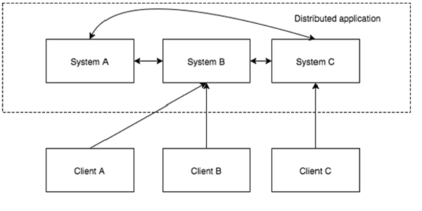

## 简介

分布式应用可以在给定时间（同时）在网络中的多个系统上运行，通过协调它们以快速有效的方式完成特定任务。通常来说，对于复杂而耗时的任务，非分布式应用（运行在单个系统中）需要几个小时才能完成，而分布式应用通过使用所有系统涉及的计算能力可以在几分钟内完成。

通过将分布式应用配置为在更多系统上运行，可以进一步减少完成任务的时间。分布式应用正在运行的一组系统称为集群，而在集群中运行的每台机器被称为节点。

分布式应用有两部分， **Server（服务器** 和 **Client（客户端** 应用程序。服务器应用程序实际上是分布式的，并具有通用接口，以便客户端可以连接到集群中的任何服务器并获得相同的结果。 客户端应用程序是与分布式应用进行交互的工具。

**分布式应用的优点**
	
	可靠性 - 单个或几个系统的故障不会使整个系统出现故障。

	可扩展性 - 可以在需要时增加性能，通过添加更多机器，在应用程序配置中进行微小的更改，而不会有停机时间。

	透明性 - 隐藏系统的复杂性，并将其显示为单个实体/应用程序。

**分布式应用的挑战**
	
	竞争条件 - 两个或多个机器尝试执行特定任务，实际上只需在任意给定时间由单个机器完成。例如，共享资源只能在任意给定时间由单个机器修改。

	死锁 - 两个或多个操作等待彼此无限期完成。

	不一致 - 数据的部分失败。