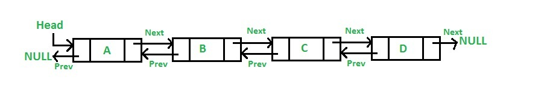

# ArrayList/Vector 的底层分析

## ArrayList

`ArrayList` 实现于 `List`、`RandomAccess` 接口。可以插入空数据，也支持随机访问。

`ArrayList `相当于动态数据，其中最重要的两个属性分别是:
`elementData` 数组，以及 `size` 大小。
在调用 `add()` 方法的时候：
```java
    public boolean add(E e) {
        ensureCapacityInternal(size + 1);  // Increments modCount!!
        elementData[size++] = e;
        return true;
    }
```

- 首先进行扩容校验。
- 将插入的值放到尾部，并将 size + 1 。

如果是调用 `add(index,e)` 在指定位置添加的话：
```java
    public void add(int index, E element) {
        rangeCheckForAdd(index);

        ensureCapacityInternal(size + 1);  // Increments modCount!!
        //复制，向后移动
        System.arraycopy(elementData, index, elementData, index + 1,
                         size - index);
        elementData[index] = element;
        size++;
    }
```


- 也是首先扩容校验。
- 接着对数据进行复制，目的是把 index 位置空出来放本次插入的数据，并将后面的数据向后移动一个位置。

其实扩容最终调用的代码:
```java
    private void grow(int minCapacity) {
        // overflow-conscious code
        int oldCapacity = elementData.length;
        int newCapacity = oldCapacity + (oldCapacity >> 1);
        if (newCapacity - minCapacity < 0)
            newCapacity = minCapacity;
        if (newCapacity - MAX_ARRAY_SIZE > 0)
            newCapacity = hugeCapacity(minCapacity);
        // minCapacity is usually close to size, so this is a win:
        elementData = Arrays.copyOf(elementData, newCapacity);
    }
```

也是一个数组复制的过程。

由此可见 `ArrayList` 的主要消耗是数组扩容以及在指定位置添加数据，在日常使用时最好是指定大小，尽量减少扩容。更要减少在指定位置插入数据的操作。

### 序列化

由于 ArrayList 是基于动态数组实现的，所以并不是所有的空间都被使用。因此使用了 `transient` 修饰，可以防止被自动序列化。

```java
transient Object[] elementData;
```

因此 ArrayList 自定义了序列化与反序列化：

```java
    private void writeObject(java.io.ObjectOutputStream s)
        throws java.io.IOException{
        // Write out element count, and any hidden stuff
        int expectedModCount = modCount;
        s.defaultWriteObject();

        // Write out size as capacity for behavioural compatibility with clone()
        s.writeInt(size);

        // Write out all elements in the proper order.
        //只序列化了被使用的数据
        for (int i=0; i<size; i++) {
            s.writeObject(elementData[i]);
        }

        if (modCount != expectedModCount) {
            throw new ConcurrentModificationException();
        }
    }

    private void readObject(java.io.ObjectInputStream s)
        throws java.io.IOException, ClassNotFoundException {
        elementData = EMPTY_ELEMENTDATA;

        // Read in size, and any hidden stuff
        s.defaultReadObject();

        // Read in capacity
        s.readInt(); // ignored

        if (size > 0) {
            // be like clone(), allocate array based upon size not capacity
            ensureCapacityInternal(size);

            Object[] a = elementData;
            // Read in all elements in the proper order.
            for (int i=0; i<size; i++) {
                a[i] = s.readObject();
            }
        }
    }
```

> 当对象中自定义了 writeObject 和 readObject 方法时，JVM 会调用这两个自定义方法来实现序列化与反序列化。


从实现中可以看出 ArrayList 只序列化了被使用的数据。


## Vector

`Vector` 也是实现于 `List` 接口，底层数据结构和 `ArrayList` 类似,也是一个动态数组存放数据。不过是在 `add()` 方法的时候使用 `synchronized` 进行同步写数据，但是开销较大，所以 `Vector` 是一个同步容器并不是一个并发容器。

以下是 `add()` 方法：
```java
    public synchronized boolean add(E e) {
        modCount++;
        ensureCapacityHelper(elementCount + 1);
        elementData[elementCount++] = e;
        return true;
    }
```

以及指定位置插入数据:
```java
    public void add(int index, E element) {
        insertElementAt(element, index);
    }
    public synchronized void insertElementAt(E obj, int index) {
        modCount++;
        if (index > elementCount) {
            throw new ArrayIndexOutOfBoundsException(index
                                                     + " > " + elementCount);
        }
        ensureCapacityHelper(elementCount + 1);
        System.arraycopy(elementData, index, elementData, index + 1, elementCount - index);
        elementData[index] = obj;
        elementCount++;
    }
```


# HashSet

`HashSet` 是一个不允许存储重复元素的集合，它的实现比较简单，只要理解了 `HashMap`，`HashSet` 就水到渠成了。

## 成员变量
首先了解下 `HashSet` 的成员变量:

```java
    private transient HashMap<E,Object> map;

    // Dummy value to associate with an Object in the backing Map
    private static final Object PRESENT = new Object();
```

发现主要就两个变量:

- `map` ：用于存放最终数据的。
- `PRESENT` ：是所有写入 map 的 `value` 值。

## 构造函数

```java
    public HashSet() {
        map = new HashMap<>();
    }
    
    public HashSet(int initialCapacity, float loadFactor) {
        map = new HashMap<>(initialCapacity, loadFactor);
    }    
```
构造函数很简单，利用了 `HashMap` 初始化了 `map` 。

## add

```java
    public boolean add(E e) {
        return map.put(e, PRESENT)==null;
    }
```

比较关键的就是这个 `add()` 方法。
可以看出它是将存放的对象当做了 `HashMap` 的健，`value` 都是相同的 `PRESENT` 。由于 `HashMap` 的 `key` 是不能重复的，所以每当有重复的值写入到 `HashSet` 时，`value` 会被覆盖，但 `key` 不会受到影响，这样就保证了 `HashSet` 中只能存放不重复的元素。

## 总结

`HashSet` 的原理比较简单，几乎全部借助于 `HashMap` 来实现的。

所以 `HashMap` 会出现的问题 `HashSet` 依然不能避免。

# LinkedHashMap 底层分析

众所周知 [HashMap](/study/HashMap.md) 是一个无序的 `Map`，因为每次根据 `key` 的 `hashcode` 映射到 `Entry` 数组上，所以遍历出来的顺序并不是写入的顺序。

因此 JDK 推出一个基于 `HashMap` 但具有顺序的 `LinkedHashMap` 来解决有排序需求的场景。

它的底层是继承于 `HashMap` 实现的，由一个双向链表所构成。

`LinkedHashMap` 的排序方式有两种：

- 根据写入顺序排序。
- 根据访问顺序排序。

其中根据访问顺序排序时，每次 `get` 都会将访问的值移动到链表末尾，这样重复操作就能得到一个按照访问顺序排序的链表。

## 数据结构

```java
	@Test
	public void test(){
		Map<String, Integer> map = new LinkedHashMap<String, Integer>();
		map.put("1",1) ;
		map.put("2",2) ;
		map.put("3",3) ;
		map.put("4",4) ;
		map.put("5",5) ;
		System.out.println(map.toString());

	}
```

调试可以看到 `map` 的组成：


打开源码可以看到：

```java
    /**
     * The head of the doubly linked list.
     */
    private transient Entry<K,V> header;

    /**
     * The iteration ordering method for this linked hash map: <tt>true</tt>
     * for access-order, <tt>false</tt> for insertion-order.
     *
     * @serial
     */
    private final boolean accessOrder;
    
    private static class Entry<K,V> extends HashMap.Entry<K,V> {
        // These fields comprise the doubly linked list used for iteration.
        Entry<K,V> before, after;

        Entry(int hash, K key, V value, HashMap.Entry<K,V> next) {
            super(hash, key, value, next);
        }
    }  
```

其中 `Entry` 继承于 `HashMap` 的 `Entry`，并新增了上下节点的指针，也就形成了双向链表。

还有一个 `header` 的成员变量，是这个双向链表的头结点。 

上边的 demo 总结成一张图如下：


第一个类似于 `HashMap` 的结构，利用 `Entry` 中的 `next` 指针进行关联。

下边则是 `LinkedHashMap` 如何达到有序的关键。

就是利用了头节点和其余的各个节点之间通过 `Entry` 中的 `after` 和 `before` 指针进行关联。


其中还有一个 `accessOrder` 成员变量，默认是 `false`，默认按照插入顺序排序，为 `true` 时按照访问顺序排序，也可以调用:

```
    public LinkedHashMap(int initialCapacity,
                         float loadFactor,
                         boolean accessOrder) {
        super(initialCapacity, loadFactor);
        this.accessOrder = accessOrder;
    }
```

这个构造方法可以显示的传入 `accessOrder `。


## 构造方法

`LinkedHashMap` 的构造方法:

```java
    public LinkedHashMap() {
        super();
        accessOrder = false;
    }
```

其实就是调用的 `HashMap` 的构造方法:

`HashMap` 实现：

```java
    public HashMap(int initialCapacity, float loadFactor) {
        if (initialCapacity < 0)
            throw new IllegalArgumentException("Illegal initial capacity: " +
                                               initialCapacity);
        if (initialCapacity > MAXIMUM_CAPACITY)
            initialCapacity = MAXIMUM_CAPACITY;
        if (loadFactor <= 0 || Float.isNaN(loadFactor))
            throw new IllegalArgumentException("Illegal load factor: " +
                                               loadFactor);

        this.loadFactor = loadFactor;
        threshold = initialCapacity;
        //HashMap 只是定义了改方法，具体实现交给了 LinkedHashMap
        init();
    }
```

可以看到里面有一个空的 `init()`，具体是由 `LinkedHashMap` 来实现的：

```java
    @Override
    void init() {
        header = new Entry<>(-1, null, null, null);
        header.before = header.after = header;
    }
```
其实也就是对 `header` 进行了初始化。

## put() 方法

看 `LinkedHashMap` 的 `put()` 方法之前先看看 `HashMap` 的 `put` 方法：

```
    public V put(K key, V value) {
        if (table == EMPTY_TABLE) {
            inflateTable(threshold);
        }
        if (key == null)
            return putForNullKey(value);
        int hash = hash(key);
        int i = indexFor(hash, table.length);
        for (Entry<K,V> e = table[i]; e != null; e = e.next) {
            Object k;
            if (e.hash == hash && ((k = e.key) == key || key.equals(k))) {
                V oldValue = e.value;
                e.value = value;
                //空实现，交给 LinkedHashMap 自己实现
                e.recordAccess(this);
                return oldValue;
            }
        }

        modCount++;
        // LinkedHashMap 对其重写
        addEntry(hash, key, value, i);
        return null;
    }
    
    // LinkedHashMap 对其重写
    void addEntry(int hash, K key, V value, int bucketIndex) {
        if ((size >= threshold) && (null != table[bucketIndex])) {
            resize(2 * table.length);
            hash = (null != key) ? hash(key) : 0;
            bucketIndex = indexFor(hash, table.length);
        }

        createEntry(hash, key, value, bucketIndex);
    }
    
    // LinkedHashMap 对其重写
    void createEntry(int hash, K key, V value, int bucketIndex) {
        Entry<K,V> e = table[bucketIndex];
        table[bucketIndex] = new Entry<>(hash, key, value, e);
        size++;
    }       
```

主体的实现都是借助于 `HashMap` 来完成的，只是对其中的 `recordAccess(), addEntry(), createEntry()` 进行了重写。

`LinkedHashMap` 的实现：

```java
        //就是判断是否是根据访问顺序排序，如果是则需要将当前这个 Entry 移动到链表的末尾
        void recordAccess(HashMap<K,V> m) {
            LinkedHashMap<K,V> lm = (LinkedHashMap<K,V>)m;
            if (lm.accessOrder) {
                lm.modCount++;
                remove();
                addBefore(lm.header);
            }
        }
        
        
    //调用了 HashMap 的实现，并判断是否需要删除最少使用的 Entry(默认不删除)    
    void addEntry(int hash, K key, V value, int bucketIndex) {
        super.addEntry(hash, key, value, bucketIndex);

        // Remove eldest entry if instructed
        Entry<K,V> eldest = header.after;
        if (removeEldestEntry(eldest)) {
            removeEntryForKey(eldest.key);
        }
    }
    
    void createEntry(int hash, K key, V value, int bucketIndex) {
        HashMap.Entry<K,V> old = table[bucketIndex];
        Entry<K,V> e = new Entry<>(hash, key, value, old);
        //就多了这一步，将新增的 Entry 加入到 header 双向链表中
        table[bucketIndex] = e;
        e.addBefore(header);
        size++;
    }
    
        //写入到双向链表中
        private void addBefore(Entry<K,V> existingEntry) {
            after  = existingEntry;
            before = existingEntry.before;
            before.after = this;
            after.before = this;
        }  
        
```

## get 方法

LinkedHashMap 的 `get()` 方法也重写了：

```java
    public V get(Object key) {
        Entry<K,V> e = (Entry<K,V>)getEntry(key);
        if (e == null)
            return null;
            
        //多了一个判断是否是按照访问顺序排序，是则将当前的 Entry 移动到链表头部。   
        e.recordAccess(this);
        return e.value;
    }
    
    void recordAccess(HashMap<K,V> m) {
        LinkedHashMap<K,V> lm = (LinkedHashMap<K,V>)m;
        if (lm.accessOrder) {
            lm.modCount++;
            
            //删除
            remove();
            //添加到头部
            addBefore(lm.header);
        }
    }
    
    
```

`clear()` 清空就要比较简单了：

```java
    //只需要把指针都指向自己即可，原本那些 Entry 没有引用之后就会被 JVM 自动回收。
    public void clear() {
        super.clear();
        header.before = header.after = header;
    }
```


## 总结

总的来说 `LinkedHashMap` 其实就是对 `HashMap` 进行了拓展，使用了双向链表来保证了顺序性。

因为是继承与 `HashMap` 的，所以一些 `HashMap` 存在的问题 `LinkedHashMap` 也会存在，比如不支持并发等。


# LinkedList 底层分析



如图所示 `LinkedList` 底层是基于双向链表实现的，也是实现了 `List` 接口，所以也拥有 List 的一些特点(JDK1.7/8 之后取消了循环，修改为双向链表)。

## 新增方法

```java
    public boolean add(E e) {
        linkLast(e);
        return true;
    }
     /**
     * Links e as last element.
     */
    void linkLast(E e) {
        final Node<E> l = last;
        final Node<E> newNode = new Node<>(l, e, null);
        last = newNode;
        if (l == null)
            first = newNode;
        else
            l.next = newNode;
        size++;
        modCount++;
    }
```

可见每次插入都是移动指针，和 ArrayList 的拷贝数组来说效率要高上不少。

## 查询方法

```java
    public E get(int index) {
        checkElementIndex(index);
        return node(index).item;
    }
    
    Node<E> node(int index) {
        // assert isElementIndex(index);

        if (index < (size >> 1)) {
            Node<E> x = first;
            for (int i = 0; i < index; i++)
                x = x.next;
            return x;
        } else {
            Node<E> x = last;
            for (int i = size - 1; i > index; i--)
                x = x.prev;
            return x;
        }
    }
```

上述代码，利用了双向链表的特性，如果`index`离链表头比较近，就从节点头部遍历。否则就从节点尾部开始遍历。使用空间（双向链表）来换取时间。

- `node()`会以`O(n/2)`的性能去获取一个结点
    - 如果索引值大于链表大小的一半，那么将从尾结点开始遍历

这样的效率是非常低的，特别是当 index 越接近 size 的中间值时。

总结：

- LinkedList 插入，删除都是移动指针效率很高。
- 查找需要进行遍历查询，效率较低。
