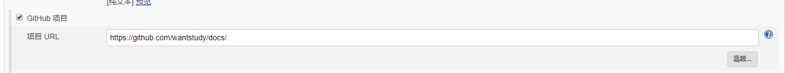

### Jenkins 介绍

> 简介		

	Jenkins 是一个开源项目，提供了一种易于使用的持续集成系统，使开发者从繁杂的集成中解脱出来，
	专注于更为重要的业务逻辑实现上。同时 Jenkins能实施监控集成中存在的错误，提供详细的日志文件
	和提醒功能，还能用图表的形式形象地展示项目构建的趋势和稳定性

> 优点

	1.采用shell自定义脚本,控制集成部署环境更加方便灵活

	2.精简war包中的lib包,常驻tomcat里，减少war包传输时间

	3.Jenkins 用户权限管理，不让淘气鬼乱动

	4.构建失败发邮件通知相关人员解决

	5.自动按天备份war包,Jenkins配置备份以及版本控制化

> 功能

	1、项目的"自动化"构建，编译、打包、分发部署。

	2、监控外部调用执行的工作。

### 下载安装

	wget  https://pkg.jenkins.io/redhat-stable/jenkins-2.138.3-1.1.noarch.rpm
	rpm -ivh jenkins-2.138.3-1.1.noarch.rpm
	service jenkins start

	1. 访问 localhost:8080
	2. 初次访问需要输入默认密码，文件路径为  /var/lib/jenkins/secret.key
	3. 确定后配置 admin 密码，以后登陆就用这个密码

### 界面说明

   


### 构建项目配置
	
   *给jenkins用户增加权限,为后期执行脚本做准备*

	vim /etc/sudoers
	增加下面两行
	jenkins ALL=(ALL)       ALL
	jenkins ALL=(ALL) NOPASSWD:ALL


   *配置工具*

   	系统管理 --> 全局工具配置
   	git jdk maven ant docker 等配置
	


### 项目部署

 [转载地址](https://blog.csdn.net/taishanduba/article/details/61423121)

 [External job](https://wiki.jenkins.io/display/JENKINS/Monitoring+external+jobs)
 
 [Pipeline](http://www.360doc.com/content/14/1121/15/10058718_426936481.shtml)	

 [Multi-configuration project](http://softlab.sdut.edu.cn/blog/subaochen/2016/11/jenkins%E5%88%86%E5%B8%83%E5%BC%8F%E6%9E%84%E5%BB%BA%E7%8E%AF%E5%A2%83%E7%9A%84%E6%90%AD%E5%BB%BA/)

   **新建项目说明**

	1.Freestyle project 
		这个是jenkins的基础功能,可以用它来执行各种构建任务,他只能构建在一个电脑上,
		如果没有太多的需求,这个job基本够用了,它包含了所有基础功能. 
	2.Pipeline 
		真实的工作环境有很多job，比如先编译，然后执行静态代码检查、单元测试、然后部署服务器、
		服务器重启、进行ui测试等。我们需要对这些job进行一些设置将它们的上下游关系配置好。
		这个时候就需要pipeline配置了.

	3.External job 
		用来监视外部执行的job.

	4.Multi-configuration project 
		可以让job跑在不同的机器上.这个需要添加机器(节点)
   

   	

   

   

#### General:一般设置

	Project name:项目名称 
	Description:项目描述,多人写作请一定要加上 
	Discard old builds:该选项配置如何抛弃旧的构建 
	每次构建相关的文件都会保存下来，将会渐渐耗光磁盘空间，为此提供两种方式供选择： 
	- Days to keep builds：如果其值为非空的N，就留N天之内的构建文件 
	- Max # of builds to keep：如果#为非空，就公保留最多#个最近构建的相关文件 
	- days to keep artifcts 产品保留时间,但是log,历史记录会保留 
	- builds to keep with artifacts 保留最近几个构建的产品 
	This project is parameterized:可以设置用户可输入的参数,没有输入则使用默认值,有字符串,多行字符串,布尔值等可以设置.wiki 
	Throttle builds:设置两个build任务之间最小间隔和同一个时间内最大任务数量 
	Disable this project:停止这个job,当例如源码不可用时,可以暂时勾选这个停止build 
	Execute concurrent builds if necessary: 如果可以会并发执行build.勾选上后.如果有足够的线程池则会并发,否则不会.并发构建会在不同的workspace中.如果用户自己设置的workspace则不会分开,这个是有风险的. 
	Restrict where this project can be run: 设置是否必须在某个机器上运行.如果是分布式部署或者迁移job,注意移除或修改此项配置 
	Quiet period:配置等待未发生提交变化的时间. 由于 jenkins检测到代码变化时,就自动立即构建，但是有些情况下， 需要多次提交代码到版本控制系统上，此时,可能发生代码还没完整提交就开始构建,造成构建失败,为防止此种情况发生,可以配置值X,则jenkins会在代码变化后等待X秒,如果没在发生代码提交,才开始构建,保证稳定性。 
	Block build when downstream project is building:该选项当多个相关联的项目由一个提交所影响，但是它们必须以一个指定的顺序进行构建的时候非常有用。当你选择这个选项的时候，Jenkins将会在启动这个构建之前，完成任何上游构建Job； 例如使用pipes的时候

   

#### Source Code Management:源码管理

	通过这里设置源码管理路径,<这个与后面的轮询源码变化触发编译是成对的 class="不想设置或者后面有脚本可以自主管理可以选择none"></这个与后面的轮询源码变化触发编译是成对的>

   

#### Build Triggers:构建(编译,任务等等)触发时机

	Trigger builds remotely (e.g., from scripts):外部通过url命令触发,拼接token和url就可以进行远程触发了 
	Build after other projects are built:监控其他job的构建状态,触发此job.如监听代码提交,然后触发UITest,静态分析等. 
	Build periodically:定时触发.选择 Build periodically,在 Schedule 中填写 0 * * * .第一个参数代表的是分钟 minute,取值 0~59;第二个参数代表的是小时 hour,取值 0~23;第三个参数代表的是天 day,取值 1~31;第四个参数代表的是月 month,取值 1~12;最后一个参数代表的是星期 week,取值 0~7，0 和 7 都是表示星期天。所以 0 * * * 表示的就是每个小时的第 0 分钟执行一次构建。举个例子:每周六10点构建 0 10 * * 6,0-0分钟, 10-10点 -任意天 -任务月份 6-周六, 0可以改为H. 
	Poll SCM:定时感知代码分支是否有变化,如果有变化的话,执行一次构建.示例：H/5 * * * * 每五分钟去检查一下远程仓库,看代码是否发生变化。 
	**GitHub hook trigger for GITScm polling:**hookplugin检测到源码的push操作触发构建,感觉Poll SCM更方便些,如果提交频繁,则这个触发就会频繁,看业务需要设置.

   

#### Build Environment(设置构建环境)

	Delete workspace before build starts:默认删除所有的,也可以设置删除特定的文件 
	- Patterns for files to be deleted:正则匹配删除哪些文件 
	- Apply pattern also on directories:规则是否也应用到文件夹 
	- Check parameter:是否删除,是个bool值,true则删除,false不删除.为毛感觉这个有点鸡肋 
	- External Deletion Command:执行外部删除命令 
	Abort the build if it’s stuck:构建阻塞的时候,根据超时策略处理. 
	- Time-out strategy:超时策略,有绝对时间,相对时间,根据以前的构建时间判断等 
	- Time-out variable:超时时间 
	- Time-out actions:超时后的处理,如终结,faile调或者写描述 
	- Add timestamps to the Console Output:在输出界面添加时间戳 
	- Use secret text(s) or file:使用密文,用于全局性的管理密码等,勾选后会在下方出现Binding,输入需要的用户名,密码证书等就可以了

   

#### 4.Build(构建)

	这个可以执行多种命令,如window的批处理,shell等一般shell就可以了.平时的自定义编译命令,打包等等,都可以写在这里.jenkins推荐将过长的命令写到下载的源码里,由这个里面的shell命令调用.jenkins执行的时候会默认把所有的命令都打印出来,这样方便调试.可以创建多个build step,这些step是串行的,一个faile,,后面的step都不会执行了.

   

#### Post-build Actions

	可以根据build的结果设置发送邮件,打包,执行其他任务等等.build成功还是失败都会走到这一步.


### git项目部署

   
   
   
   

   *jenkins_deploy_git_docs.sh 脚本内容*
```
#!/bin/sh
#获取指定进程pid
function getPid(){
   pid=`ps -ef|grep -v grep|grep docsify |awk '{print $2}'`
   pid_num=`echo $pid|wc -w`
}

getPid
echo $pid_num
#如果pid为空,直接启动,如果不为空,杀掉进程后再次启动
if [ $pid_num != 0 ];then
        echo '当前运行pid:' $pid
        `echo $pid |xargs -n1  kill -9`
        getPid
        if [ $pid_num != 0 ];then
                `echo $pid |xargs -n1  kill -9`
        else
                sudo  /root/software/node/node-v8.9.3-linux-x64/lib/node_modules/docsify-cli/bin/docsify serve /var/lib/jenkins/workspace/git-docs &
        fi
else
       	#重启服务
        sudo /root/software/node/node-v8.9.3-linux-x64/lib/node_modules/docsify-cli/bin/docsify serve /var/lib/jenkins/workspace/git-docs &
        getPid
        echo '部署后pid' $pid
fi
```

### maven 项目部署

