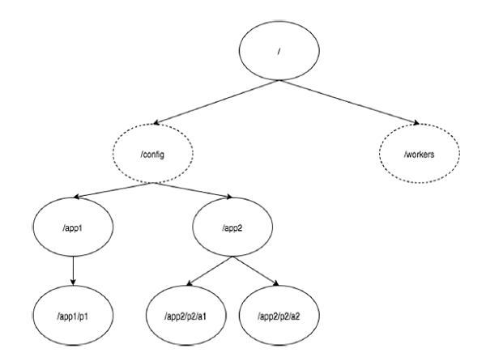

## 什么是Apache ZooKeeper？

Apache ZooKeeper是由集群（节点组）使用的一种服务，用于在自身之间协调，并通过稳健的同步技术维护共享数据。ZooKeeper本身是一个分布式应用程序，为写入分布式应用程序提供服务。

> ZooKeeper提供的常见服务如下 :

+ 命名服务 - 按名称标识集群中的节点。它类似于DNS，但仅对于节点。

+ 配置管理 - 加入节点的最近的和最新的系统配置信息。

+ 集群管理 - 实时地在集群和节点状态中加入/离开节点。

+ 选举算法 - 选举一个节点作为协调目的的leader。

+ 锁定和同步服务 - 在修改数据的同时锁定数据。此机制可帮助你在连接其他分布式应用程序（如Apache HBase）时进行自动故障恢复。

+ 高度可靠的数据注册表 - 即使在一个或几个节点关闭时也可以获得数据。

分布式应用程序提供了很多好处，但它们也抛出了一些复杂和难以解决的挑战。ZooKeeper框架提供了一个完整的机制来克服所有的挑战。竞争条件和死锁使用故障安全同步方法进行处理。另一个主要缺点是数据的不一致性，ZooKeeper使用原子性解析。

>ZooKeeper的好处

+ 简单的分布式协调过程

+ 同步 - 服务器进程之间的相互排斥和协作。此过程有助于Apache HBase进行配置管理。

+ 有序的消息

+ 序列化 - 根据特定规则对数据进行编码。确保应用程序运行一致。这种方法可以在MapReduce中用来协调队列以执行运行的线程。

+ 可靠性

+ 原子性 - 数据转移完全成功或完全失败，但没有事务是部分的。

## 安装使用

zookeeper 下载地址: [http://zookeeper.apache.org/releases.html](http://zookeeper.apache.org/releases.html)

> 解压

	tar -zxf zookeeper-3.4.6.tar.gz
	cd zookeeper-3.4.6	
	mkdir data

> 修改配置文件 vi conf/zoo.cfg
	
	tickTime = 2000
	dataDir = /path/to/zookeeper/data
	clientPort = 2181
	initLimit = 5
	syncLimit = 2

> 启动 server

	bin/zkServer.sh start

> 启动 client

	bin/zkCli.sh

> 停止 server

	bin/zkServer.sh stop

## ZooKeeper基础

### ZooKeeper的架构

> 组件说明

|组件|说明|
|----------|---------|
|Client(客户端)| 客户端，我们的分布式应用集群中的一个节点，从服务器访问信息。对于特定的时间间隔，每个客户端向服务器发送消息以使服务器知道客户端是活跃的。类似地，当客户端连接时，服务器发送确认码。如果连接的服务器没有响应，客户端会自动将消息重定向到另一个服务器。|
|Server(服务器)| 服务器，我们的ZooKeeper总体中的一个节点，为客户端提供所有的服务。向客户端发送确认码以告知服务器是活跃的。|
|Ensemble| ZooKeeper服务器组。形成ensemble所需的最小节点数为3。|
|Leader| 服务器节点，如果任何连接的节点失败，则执行自动恢复。Leader在服务启动时被选举。|
|Follower|	跟随leader指令的服务器节点。|

### 层次命名空间

下图描述了用于内存表示的ZooKeeper文件系统的树结构。ZooKeeper节点称为 znode 。每个znode由一个名称标识，并用路径(/)序列分隔。

在图中，首先有一个由“/”分隔的znode。在根目录下，你有两个逻辑命名空间 config 和 workers 。

config 命名空间用于集中式配置管理，workers 命名空间用于命名。

在 config 命名空间下，每个znode最多可存储1MB的数据。这与UNIX文件系统相类似，除了父znode也可以存储数据。这种结构的主要目的是存储同步数据并描述znode的元数据。此结构称为 ZooKeeper数据模型。

ZooKeeper数据模型中的每个znode都维护着一个 stat 结构。一个stat仅提供一个znode的元数据。它由版本号，操作控制列表(ACL)，时间戳和数据长度组成。

+ 版本号 - 每个znode都有版本号，这意味着每当与znode相关联的数据发生变化时，其对应的版本号也会增加。当多个zookeeper客户端尝试在同一znode上执行操作时，版本号的使用就很重要。

+ 操作控制列表(ACL) - ACL基本上是访问znode的认证机制。它管理所有znode读取和写入操作。

+ 时间戳 - 时间戳表示创建和修改znode所经过的时间。它通常以毫秒为单位。ZooKeeper从“事务ID"(zxid)标识znode的每个更改。Zxid 是唯一的，并且为每个事务保留时间，以便你可以轻松地确定从一个请求到另一个请求所经过的时间。

+ 数据长度 - 存储在znode中的数据总量是数据长度。你最多可以存储1MB的数据。

### Znode的类型

> Znode被分为持久（persistent）节点，顺序（sequential）节点和临时（ephemeral）节点。

+ 持久节点  - 即使在创建该特定znode的客户端断开连接后，持久节点仍然存在。默认情况下，除非另有说明，否则所有znode都是持久的。

+ 临时节点 - 客户端活跃时，临时节点就是有效的。当客户端与ZooKeeper集合断开连接时，临时节点会自动删除。因此，只有临时节点不允许有子节点。如果临时节点被删除，则下一个合适的节点将填充其位置。临时节点在leader选举中起着重要作用。

+ 顺序节点 - 顺序节点可以是持久的或临时的。当一个新的znode被创建为一个顺序节点时，ZooKeeper通过将10位的序列号附加到原始名称来设置znode的路径。例如，如果将具有路径 /myapp 的znode创建为顺序节点，则ZooKeeper会将路径更改为 /myapp0000000001 ，并将下一个序列号设置为0000000002。如果两个顺序节点是同时创建的，那么ZooKeeper不会对每个znode使用相同的数字。顺序节点在锁定和同步中起重要作用。

### Sessions（会话）

会话对于ZooKeeper的操作非常重要。会话中的请求按FIFO顺序执行。一旦客户端连接到服务器，将建立会话并向客户端分配会话ID 。

客户端以特定的时间间隔发送心跳以保持会话有效。如果ZooKeeper集合在超过服务器开启时指定的期间（会话超时）都没有从客户端接收到心跳，则它会判定客户端死机。

会话超时通常以毫秒为单位。当会话由于任何原因结束时，在该会话期间创建的临时节点也会被删除。

### Watches（监视）

监视是一种简单的机制，使客户端收到关于ZooKeeper集合中的更改的通知。客户端可以在读取特定znode时设置Watches。Watches会向注册的客户端发送任何znode（客户端注册表）更改的通知。

Znode更改是与znode相关的数据的修改或znode的子项中的更改。只触发一次watches。如果客户端想要再次通知，则必须通过另一个读取操作来完成。当连接会话过期时，客户端将与服务器断开连接，相关的watches也将被删除。

## Zookeeper 工作流

一旦ZooKeeper集合启动，它将等待客户端连接。客户端将连接到ZooKeeper集合中的一个节点。它可以是leader或follower节点。一旦客户端被连接，节点将向特定客户端分配会话ID并向该客户端发送确认。如果客户端没有收到确认，它将尝试连接ZooKeeper集合中的另一个节点。 一旦连接到节点，客户端将以有规律的间隔向节点发送心跳，以确保连接不会丢失。

+ 如果客户端想要读取特定的znode，它将会向具有znode路径的节点发送读取请求，并且节点通过从其自己的数据库获取来返回所请求的znode。为此，在ZooKeeper集合中读取速度很快。

+ 如果客户端想要将数据存储在ZooKeeper集合中，则会将znode路径和数据发送到服务器。连接的服务器将该请求转发给leader，然后leader将向所有的follower重新发出写入请求。如果只有大部分节点成功响应，而写入请求成功，则成功返回代码将被发送到客户端。 否则，写入请求失败。绝大多数节点被称为 Quorum 。

> ZooKeeper集合中的节点
让我们分析在ZooKeeper集合中拥有不同数量的节点的效果。

+ 如果我们有单个节点，则当该节点故障时，ZooKeeper集合将故障。它有助于“单点故障"，不建议在生产环境中使用。

+ 如果我们有两个节点而一个节点故障，我们没有占多数，因为两个中的一个不是多数。

+ 如果我们有三个节点而一个节点故障，那么我们有大多数，因此，这是最低要求。ZooKeeper集合在实际生产环境中必须至少有三个节点。

+ 如果我们有四个节点而两个节点故障，它将再次故障。类似于有三个节点，额外节点不用于任何目的，因此，最好添加奇数的节点，例如3，5，7。

我们知道写入过程比ZooKeeper集合中的读取过程要贵，因为所有节点都需要在数据库中写入相同的数据。因此，对于平衡的环境拥有较少数量（例如3，5，7）的节点比拥有大量的节点要好。

下图描述了ZooKeeper工作流，后面的表说明了它的不同组件。

<table>
	<tr>
		<td style="width: 300px;">组件</td>
		<td>描述</td>
	</tr>
    <tr>
        <td>写入（write）</td>
        <td>写入过程由leader节点处理。leader将写入请求转发到所有znode，并等待znode的回复。如果一半的znode回复，则写入过程完成</td>
    </tr>
    <tr>
        <td>读取（read）</td>
        <td>读取由特定连接的znode在内部执行，因此不需要与集群进行交互</td>
    </tr>
    <tr>
        <td>复制数据库（replicated database）</td>
        <td>它用于在zookeeper中存储数据。每个znode都有自己的数据库，每个znode在一致性的帮助下每次都有相同的数据</td>
    </tr>
    <tr>
        <td>Leader</td>
        <td>Leader是负责处理写入请求的Znode</td>
    </tr>
    <tr>
        <td>Follower</td>
        <td>follower从客户端接收写入请求，并将它们转发到leader znode</td>
    </tr>
	<tr>
        <td>请求处理器（request processor）</td>
        <td>只存在于leader节点。它管理来自follower节点的写入请求</td>
    </tr>
    <tr>
        <td>原子广播（atomic broadcasts）</td>
        <td>负责广播从leader节点到follower节点的变化</td>
    </tr>
</table>

## Zookeeper leader选举

> 让我们分析如何在ZooKeeper集合中选举leader节点。考虑一个集群中有N个节点。leader选举的过程如下：

+ 所有节点创建具有相同路径 /app/leader_election/guid_ 的顺序、临时节点。

+ ZooKeeper集合将附加10位序列号到路径，创建的znode将是 /app/leader_election/guid_0000000001，/app/leader_election/guid_0000000002等。

+ 对于给定的实例，在znode中创建最小数字的节点成为leader，而所有其他节点是follower。
每个follower节点监视下一个具有最小数字的znode。例如，创建znode/app/leader_election/guid_0000000008的节点将监视znode/app/leader_election/guid_0000000007，创建znode/app/leader_election/guid_0000000007的节点将监视znode/app/leader_election/guid_0000000006。
如果leader关闭，则其相应的znode/app/leader_electionN会被删除。

+ 下一个在线follower节点将通过监视器获得关于leader移除的通知。

+ 下一个在线follower节点将检查是否存在其他具有最小数字的znode。如果没有，那么它将承担leader的角色。否则，它找到的创建具有最小数字的znode的节点将作为leader。

类似地，所有其他follower节点选举创建具有最小数字的znode的节点作为leader。
leader选举是一个复杂的过程，但ZooKeeper服务使它非常简单

## Zookeeper CLI

> ZooKeeper命令行界面（CLI）用于与ZooKeeper集合进行交互以进行开发。它有助于调试和解决不同的选项。

要执行ZooKeeper CLI操作，首先打开ZooKeeper服务器（“bin/zkServer.sh start”），然后打开ZooKeeper客户端（“bin/zkCli.sh”）。一旦客户端启动，你可以执行以下操作：
1. 创建znode
2. 获取数据
3. 监视znode的变化
4. 设置数据
5. 创建znode的子节点
6. 列出znode的子节点
7. 检查状态
8. 移除/删除znode

### 创建Znodes
> 用给定的路径创建一个znode。flag参数指定创建的znode是临时的，持久的还是顺序的。默认情况下，所有znode都是持久的。
当会话过期或客户端断开连接时，临时节点（flag：-e）将被自动删除。
顺序节点保证znode路径将是唯一的。
ZooKeeper集合将向znode路径填充10位序列号。例如，znode路径 /myapp 将转换为/myapp0000000001，下一个序列号将为/myapp0000000002。如果没有指定flag，则znode被认为是持久的。

语法

	create /path /data

示例

	create /FirstZnode “Myfirstzookeeper-app"

输出

	[zk: localhost:2181(CONNECTED) 0] create /FirstZnode “Myfirstzookeeper-app"
	Created /FirstZnode

> 要创建顺序节点，请添加flag：-s，如下所示。

语法
	
	create -s /path /data

示例
	
	create -s /FirstZnode second-data

输出

	[zk: localhost:2181(CONNECTED) 2] create -s /FirstZnode “second-data"
	Created /FirstZnode0000000023

> 要创建临时节点，请添加flag：-e ，如下所示。

语法

	create -e /path /data

示例

	create -e /SecondZnode “Ephemeral-data"

输出

	[zk: localhost:2181(CONNECTED) 2] create -e /SecondZnode “Ephemeral-data"
	Created /SecondZnode
记住当客户端断开连接时，临时节点将被删除。你可以通过退出ZooKeeper CLI，然后重新打开CLI来尝试。

### 获取数据
>它返回znode的关联数据和指定znode的元数据。你将获得信息，例如上次修改数据的时间，修改的位置以及数据的相关信息。此CLI还用于分配监视器以显示数据相关的通知。

语法

	get /path 

示例

	get /FirstZnode

输出

	[zk: localhost:2181(CONNECTED) 1] get /FirstZnode
	“Myfirstzookeeper-app"
	cZxid = 0x7f
	ctime = Tue Sep 29 16:15:47 IST 2015
	mZxid = 0x7f
	mtime = Tue Sep 29 16:15:47 IST 2015
	pZxid = 0x7f
	cversion = 0
	dataVersion = 0
	aclVersion = 0
	ephemeralOwner = 0x0
	dataLength = 22
	numChildren = 0

+ 要访问顺序节点，必须输入znode的完整路径。

示例

	get /FirstZnode0000000023

输出

	[zk: localhost:2181(CONNECTED) 1] get /FirstZnode0000000023
	“Second-data"
	cZxid = 0x80
	ctime = Tue Sep 29 16:25:47 IST 2015
	mZxid = 0x80
	mtime = Tue Sep 29 16:25:47 IST 2015
	pZxid = 0x80
	cversion = 0
	dataVersion = 0
	aclVersion = 0
	ephemeralOwner = 0x0
	dataLength = 13
	numChildren = 0

### Watch（监视）
> 当指定的znode或znode的子数据更改时，监视器会显示通知。你只能在 get 命令中设置watch。

语法

	get /path [watch] 1

示例

	get /FirstZnode 1

输出

	[zk: localhost:2181(CONNECTED) 1] get /FirstZnode 1
	“Myfirstzookeeper-app"
	cZxid = 0x7f
	ctime = Tue Sep 29 16:15:47 IST 2015
	mZxid = 0x7f
	mtime = Tue Sep 29 16:15:47 IST 2015
	pZxid = 0x7f
	cversion = 0
	dataVersion = 0
	aclVersion = 0
	ephemeralOwner = 0x0
	dataLength = 22
	numChildren = 0

### 设置数据

> 设置指定znode的数据。完成此设置操作后，你可以使用 get CLI命令检查数据。

语法

	set /path /data

示例

	set /SecondZnode Data-updated

输出

	[zk: localhost:2181(CONNECTED) 1] get /SecondZnode “Data-updated"
	cZxid = 0x82
	ctime = Tue Sep 29 16:29:50 IST 2015
	mZxid = 0x83
	mtime = Tue Sep 29 16:29:50 IST 2015
	pZxid = 0x82
	cversion = 0
	dataVersion = 1
	aclVersion = 0
	ephemeralOwner = 0x15018b47db00000
	dataLength = 14
	numChildren = 0
如果你在 get 命令中分配了watch选项（如上一个命令），则输出将类似如下所示。

输出

	[zk: localhost:2181(CONNECTED) 1] get /FirstZnode “Mysecondzookeeper-app"

	WATCHER: :
	WatchedEvent state:SyncConnected type:NodeDataChanged path:/FirstZnode
	cZxid = 0x7f
	ctime = Tue Sep 29 16:15:47 IST 2015
	mZxid = 0x84
	mtime = Tue Sep 29 17:14:47 IST 2015
	pZxid = 0x7f
	cversion = 0
	dataVersion = 1
	aclVersion = 0
	ephemeralOwner = 0x0
	dataLength = 23
	numChildren = 0

### 创建子项/子节点
> 创建子节点类似于创建新的znode。唯一的区别是，子znode的路径也将具有父路径。

语法

	create /parent/path/subnode/path /data

示例

	create /FirstZnode/Child1 firstchildren

输出

	[zk: localhost:2181(CONNECTED) 16] create /FirstZnode/Child1 “firstchildren"
	created /FirstZnode/Child1
	[zk: localhost:2181(CONNECTED) 17] create /FirstZnode/Child2 “secondchildren"
	created /FirstZnode/Child2

### 列出子项
> 此命令用于列出和显示znode的子项。

语法

	ls /path

示例

	ls /MyFirstZnode

输出

	[zk: localhost:2181(CONNECTED) 2] ls /MyFirstZnode
	[mysecondsubnode, myfirstsubnode]

### 检查状态

> 状态描述指定的znode的元数据。它包含时间戳，版本号，ACL，数据长度和子znode等细项。

语法

	stat /path

示例

	stat /FirstZnode

输出

	[zk: localhost:2181(CONNECTED) 1] stat /FirstZnode
	cZxid = 0x7f
	ctime = Tue Sep 29 16:15:47 IST 2015
	mZxid = 0x7f
	mtime = Tue Sep 29 17:14:24 IST 2015
	pZxid = 0x7f
	cversion = 0
	dataVersion = 1
	aclVersion = 0
	ephemeralOwner = 0x0
	dataLength = 23
	numChildren = 0

### 移除Znode
> 移除指定的znode并递归其所有子节点。只有在这样的znode可用的情况下才会发生。

语法

	rmr /path

示例

	rmr /FirstZnode

输出

	[zk: localhost:2181(CONNECTED) 10] rmr /FirstZnode
	[zk: localhost:2181(CONNECTED) 11] get /FirstZnode
	Node does not exist: /FirstZnode

_删除(delete/path)命令类似于 remove 命令，除了它只适用于没有子节点的znode_